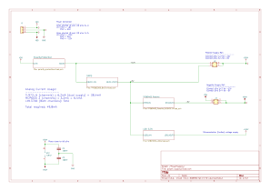

# adsr_vca_fxpedal
MCU generated ADSR envelope into a LM13700 OTA VCA

## Block diagram

The audio input signal is amplitude-modulated with the ADSR waveform using the [LM13700](docs/datasheet/lm13700.pdf) in a voltage controlled amplifier (VCA) confguration.

ADSR waveform is generated via software running on a [microcontroller](docs/datasheet/stm32l432kb_datasheet.pdf) with built-in dual DAC. Two ADSR signals are generated: Inverted and Non-inverted.

ADSR generation is triggered by detecting the peak of the input signal or by manual push button. The latter can be used as a manual retrigger mechanism.

ADSR values - attack, decay, sustain and release - can be selected and then adjusted using the four potentiometers.  

An OLED display will show the current ADSR envelope shape as it is adjusted.

The raw ADSR envelope signal and VCA output are available as buffered output on 2.54mm connectors.

Both the inverted and non-inverted ADSR-modulated signals are mixed with the original "clean" audio input signal in the output stage. The mix of all three signals can be independently adjusted.

## Power Supply Scheme

This supports both guitar applications (9VDC) and modular synth (+/-12V) by switching the jumpers.

Note the 9VDC rail is split to +/-4.5VDC.

Implementation can be seen on the schematic page

