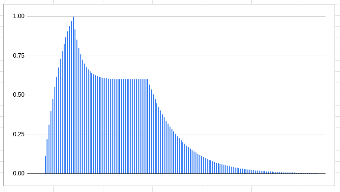

https://www.earlevel.com/main/2013/06/03/envelope-generators-adsr-code/

### Compile

```
g++ -std=c++17 *.cpp -o adsr
```

### run

```
./adsr
```

### Example output



parameters:

```
sampleRate = 80
AttackRate = 0.1s
DecayRate = 0.25s
ReleaseRate = 1s
SustainLevel = 0.6
gate duration = 100ms
```

Raw data can be found in [data.txt](data.txt)


